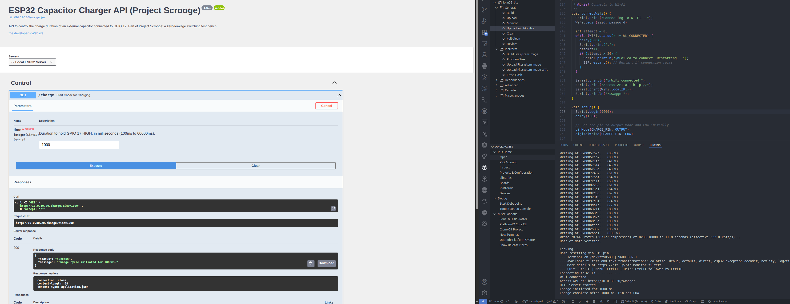

# ⚡ ESP32 Capacitor Charger API (Project Scrooge)

This project implements a lightweight Web API on an ESP32 to precisely control the charge duration of an external capacitor connected via a GPIO pin. It is designed as a foundational component for the **Project Scrooge: Zero-Leakage Switching Test Bench**, aimed at validating the use of capacitor/relay combinations for power-optimized, high-current switching applications.

The entire project is built and managed using **PlatformIO**.



## 🛠️ Prerequisites

To build and upload this project, you need:

1. **PlatformIO Core or VS Code Extension:** This project is structured for PlatformIO.

2. **ESP32 Development Board:** (e.g., ESP32 Dev Module, NodeMCU)

3. **Arduino Framework** (automatically handled by PlatformIO).

4. **Libraries:** `WiFi` and `WebServer` (standard in the ESP32 Arduino core).

## ⚙️ Hardware and Wiring

| Component | Pin | Description | 
| :--- | :--- | :--- | 
| **Capacitor Charge Output** | `CHARGE_PIN` (Default: **GPIO 17**) | Connect to the charging circuit (e.g., the base of a transistor or the input of a relay driver). | 

The GPIO pin is set HIGH to initiate charging and LOW to stop.

## 🔑 Configuration

Before uploading, you must update the Wi-Fi credentials in the `main.cpp` file:

```
// Configure your Wi-Fi credentials here 
const char* ssid = "Your_WiFi_SSID"; // <-- UPDATE THIS 
const char* password = "Your_WiFi_PASSWORD"; // <-- UPDATE THIS

// GPIO Pin Definitions
const int CHARGE_PIN = 17; // Change this if needed
```

## 🚀 API Endpoints

Once the ESP32 connects to your Wi-Fi network, it hosts a web server that is fully documented using **Swagger/OpenAPI**.

The server's IP address will be displayed in the Serial Monitor (e.g., `http://192.168.1.100`).

| Endpoint | Method | Description | 
| :--- | :--- | :--- | 
| **`/swagger`** | `GET` | **Swagger UI**: Interactive API documentation for testing. | 
| **`/swagger.json`** | `GET` | The raw OpenAPI specification file. | 
| **`/charge?time=<ms>`** | `GET` | **Start Charge Cycle**: Sets `CHARGE_PIN` HIGH for a specified duration (100ms to 60000ms). | 
| **`/state`** | `GET` | Get the current charging status, GPIO level, and time remaining (if charging). | 
| **`/stop`** | `POST` | **Emergency Stop**: Immediately sets `CHARGE_PIN` LOW and cancels any active charge cycle. | 
| **`/health`** | `GET` | Basic system health check. | 
| **`/info`** | `GET` | Project context and version information. | 

### Example Usage (cURL)

**1. Start a 5-second (5000ms) charge cycle:**
```
curl -X GET "http://<ESP32_IP>/charge?time=5000"
```

**2. Check the current status:**
```
curl -X GET "http://<ESP32_IP>/state"
```

Example Response: {"status":"charging", "gpio_level":"HIGH", "duration_ms":5000, "time_remaining_ms":1500}

**3. Stop the cycle immediately:**
```
curl -X POST "http://<ESP32_IP>/stop"
```

## 💻 Development Notes

The OpenAPI specification (`swaggerJson` variable) is defined using a standard C-string literal with escaped quotes to ensure cross-platform compatibility and avoid hidden trailing characters that often cause parsing errors in embedded environments.
